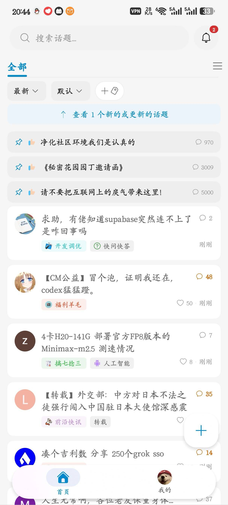
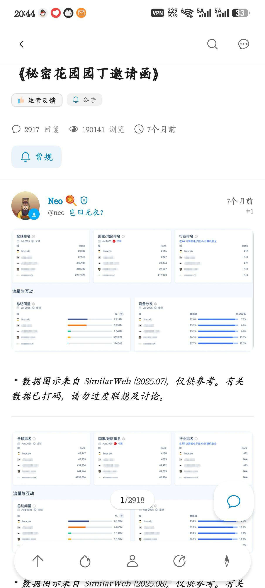
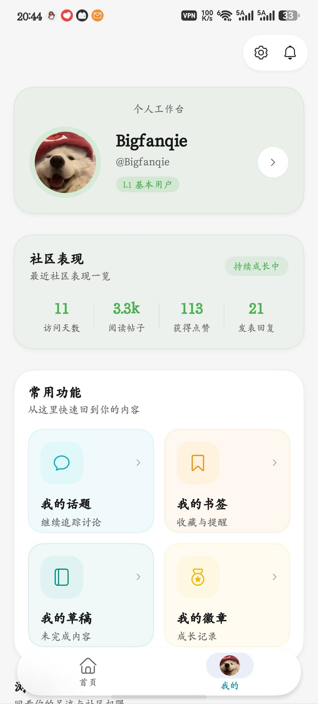

# HarmonyDO

> 一个真诚、友善、团结、专业的 [Linux.do](https://linux.do/) 第三方客户端

## 项目简介

HarmonyDO 是为 [Linux.do](https://linux.do/) 社区打造的现代化移动客户端，基于原生鸿蒙开发，致力于为用户提供流畅、优雅的论坛浏览体验。

项目在产品思路与部分交互设计上参考了 [FluxDO](https://github.com/Lingyan000/fluxdo)，并结合 HarmonyOS 的原生能力持续打磨使用体验。

## 应用截图

| 首页 | 话题详情 | 我的 |
| --- | --- | --- |
|  |  |  |

## 当前状态

项目正在积极开发中，README 也会随着功能迭代持续补充和完善。

目前聚焦：
- Linux.do 核心浏览与互动体验
- 鸿蒙原生页面与系统能力融合
- 登录、Cloudflare、会话与内容创作链路完善
- 手机 / 平板场景下的细节打磨

## 安装方式

> 目前仅支持通过 **DevEco Studio（Dev Studio）编译安装**，暂不提供预编译 HAP、应用商店分发包或一键安装脚本。

### 环境要求

- DevEco Studio
- HarmonyOS SDK `6.0.2(API 22)`
- HarmonyOS 真机或模拟器
- 可用的本地调试签名

### 安装步骤

1. 克隆仓库

   ```bash
   git clone https://github.com/Amaz1ny/HarmonyDo-public.git
   ```

2. 使用 DevEco Studio 打开项目根目录
3. 确认本地已安装 HarmonyOS `6.0.2(API 22)` SDK
4. `build-profile.json5` 中不包含真实签名密钥，请先在 DevEco Studio 中配置你自己的本地调试签名
5. 连接鸿蒙真机或启动模拟器
6. 点击运行，编译并安装到设备

## 项目特性

- 面向 [Linux.do](https://linux.do/) 社区的第三方客户端
- 基于原生鸿蒙能力构建，适配手机
- 持续对齐优秀社区客户端的交互体验与视觉细节
- 兼顾内容消费、账号管理与创作发布场景
- 深度结合 HarmonyOS 系统级能力，而不只是简单 Web 壳
- 以真诚、友善、团结、专业为产品气质

## 核心功能

当前已覆盖或正在持续完善的主要功能包括：

- **首页浏览**
  - 最新话题浏览
  - 分类浏览、标签筛选、排序与过滤
  - 新话题提示与基础实时更新链路

- **搜索能力**
  - 关键词搜索
  - 高级搜索筛选
  - 多种排序方式
  - 用户与话题结果展示

- **话题详情**
  - 富文本内容阅读
  - 图片预览
  - 跳楼与楼层定位
  - 书签、稍后读、分享等常用操作

- **账号与社区能力**
  - 登录态恢复
  - 个人中心
  - 他人主页
  - 我的话题、我的徽章、浏览历史、关注列表

- **创作能力**
  - 创建话题
  - 回复与引用回复
  - Markdown 工具栏
  - Emoji / Sticker 面板
  - 图片选择、上传与多图网格插入
  - 草稿恢复与继续编辑

- **内容管理**
  - 我的书签
  - 我的草稿
  - 阅读历史记录
  - 应用内 WebView 浏览

- **分享与导出**
  - 文本分享
  - 图片分享
  - 文件分享
  - 话题分享图生成

## 技术特性

- **原生 ArkTS + ArkUI V2 架构**
  - 使用 `@ComponentV2`、`@Local` 等 V2 状态管理能力
  - 使用 `NavPathStack` 管理应用路由

- **HarmonyOS Design System + 原生组件协作**
  - 结合 `@kit.UIDesignKit` 与 ArkUI 基础组件构建页面
  - 在视觉对齐与系统一致性之间持续打磨

- **Discourse 定制网络层**
  - 基于 `@kit.NetworkKit` 封装 `HttpClient`
  - 处理 Cookie、CSRF、上传、重试、会话隔离等问题
  - 对 Linux.do / Discourse API 做了针对性适配

- **Cloudflare 与登录链路适配**
  - 登录、验证、Cookie 同步、会话恢复均已接入
  - 通过 ArkWeb 与本地 CookieStore 协同处理验证链路

- **实时消息与后台预热**
  - 接入 MessageBus 轮询、预加载配置、会话级数据同步
  - 持续优化首页新话题、登录切换和前后台恢复体验

- **创作链路原生化**
  - Markdown 编辑
  - Emoji / Sticker / 图片上传
  - 本地预览、草稿恢复、短链缓存

- **智感握姿适配**
  - 已接入握姿感知能力
  - 当前在话题详情页中，可根据左手 / 右手握持状态动态调整回复浮动按钮位置

## 系统级 API / Kit 接入

| API / Kit | 用途 |
| --- | --- |
| `@kit.NetworkKit` | 网络请求、上传、长轮询、Discourse 接口访问 |
| `@kit.ArkWeb` | 登录页、Cloudflare 验证页、应用内 WebView、Cookie 同步 |
| `@kit.MultimodalAwarenessKit` | 智感握姿 / holding hand 状态感知 |
| `@kit.ShareKit` | 系统级文本、图片、文件分享 |
| `@kit.MediaLibraryKit` | 系统相册选择、图片读取、媒体保存 |
| `@kit.ArkUI` | 页面构建、窗口控制、`componentSnapshot` 离屏截图等 |
| `@kit.ImageKit` | 图片信息读取、图片处理相关能力 |
| `@kit.AbilityKit` | Ability 上下文、权限与应用生命周期能力 |
| `@kit.ArkData` | 本地偏好存储、共享数据类型描述 |
| `@kit.PerformanceAnalysisKit` | 日志与性能分析辅助 |
| `@ohos.file.fs` | 文件读写、导出、图片缓冲处理 |
| `@ohos.abilityAccessCtrl` | 运行时权限申请，如保存图片到相册 |

### 当前已声明权限

- `ohos.permission.INTERNET`
- `ohos.permission.DETECT_GESTURE`
- `ohos.permission.WRITE_IMAGEVIDEO`

## 项目结构说明

```text
HarmonyDO/
├─ AppScope/                         # 应用级配置
├─ entry/
│  └─ src/main/
│     ├─ ets/
│     │  ├─ common/                 # 常量、工具、主题与公共能力
│     │  ├─ entryability/           # 应用入口 Ability
│     │  ├─ entrybackupability/     # 备份相关 Ability
│     │  ├─ models/                 # 数据模型
│     │  ├─ pages/                  # 页面入口与导航装配
│     │  ├─ services/
│     │  │  ├─ auth/                # 登录与会话
│     │  │  ├─ device/              # 设备能力，如智感握姿
│     │  │  ├─ messagebus/          # 实时消息与预加载
│     │  │  ├─ network/             # 网络、Cookie、Cloudflare
│     │  │  └─ storage/             # 本地存储与偏好
│     │  └─ views/
│     │     ├─ components/          # 通用组件与编辑器组件
│     │     └─ pages/               # 业务页面
│     └─ resources/base/
│        ├─ element/                # 字符串、颜色等资源
│        ├─ media/                  # 图片与图标资源
│        └─ profile/                # 页面与模块配置资源
├─ build-profile.json5              # 构建与 SDK 配置
├─ hvigorfile.ts                    # Hvigor 构建入口
├─ oh-package.json5                 # OHPM 包配置
└─ README.md
```

### 主要页面

- `TopicListPage`：首页话题流
- `CategoryTopicPage`：分类话题页
- `SearchPage`：搜索页
- `TopicDetailPage`：话题详情页
- `LoginPage`：登录页
- `ProfilePage`：个人中心
- `UserProfilePage`：他人主页
- `BookmarksPage`：我的书签
- `DraftsPage`：我的草稿
- `BrowsingHistoryPage`：浏览历史
- `MyTopicsPage` / `MyBadgesPage`：我的话题 / 我的徽章
- `ImagePreviewPage` / `WebViewPage`：图片预览 / 应用内网页

## 关于 Linux.do

[Linux.do](https://linux.do/) 是一个真诚、友善、团结、专业的技术社区，汇聚了众多热爱技术、乐于分享的开发者。

HarmonyDO 希望为 Linux.do 社区提供更贴近鸿蒙生态的原生客户端体验。

[FluxDO](https://github.com/Lingyan000/fluxdo) 作为优秀的第三方客户端项目，致力于为社区成员提供更好的移动和桌面端体验；HarmonyDO 在此基础上聚焦鸿蒙平台，继续延伸这条路线。

## 免责声明

> 本项目为非官方客户端，与 Linux.do 官方无直接关联。

## 开源协议

本项目基于 **GPL-3.0** 协议开源，详见仓库中的 [LICENSE](./LICENSE) 文件。

## 致谢与参考链接

- 感谢 Linux.do 社区成员的讨论、反馈、建议与支持
- [Linux.do](https://linux.do/)
- [FluxDO](https://github.com/Lingyan000/fluxdo)
- [HarmonyDO](https://github.com/Amaz1ny/HarmonyDo)
